# 🚀 Automated CI/CD Pipeline with Jenkins for Secure and Scalable Deployments

## 👨‍💻 Author: **Neaga Matei**  
📍 **Bucharest, 2025**

---

## 📌 Overview

This project focuses on implementing **Continuous Integration & Continuous Deployment (CI/CD)** using **Jenkins**, Docker, and security testing tools. The **CI/CD pipeline** ensures efficient software delivery by automating the build, test, and deployment processes.

### 🔹 Key Features:
✅ **Multibranch Pipeline** - Automatically scans branches every **1 minute** ⏱️  
✅ **Parameterized Pipeline** - Enables dynamic selection of **branch** and **Docker image tag** 🏷️  
✅ **Shared Library** - Implements reusable scripts for efficiency 🔄  
✅ **Hadolint** - Static analysis for Dockerfiles 🐳  
✅ **Trivy** - Security vulnerability scanning 🛡️  
✅ **DockerHub Integration** - Pushes images to **DockerHub** 📦  
✅ **EC2 Agent** - Uses **AWS EC2** for containerized builds & testing 🌍  
✅ **Role-Based Access Control (RBAC)** - Secure user permissions 🔐  
✅ **Deployment** - Runs **Docker containers** from **DockerHub** 🏗️  

---

## 📜 Table of Contents
1️⃣ **Introduction**  
2️⃣ **CI/CD Pipeline Stages**  
   - Multibranch Pipeline 📂  
   - Shared Library 📚  
   - Jenkinsfile (Pipeline Code) 💾  
3️⃣ **Security & Compliance**  
   - Hadolint 🛠️  
   - Trivy Security Scan 🔍  
4️⃣ **Deployment Strategy**  
   - DockerHub Integration 📦  
   - Running Containers 🖥️  
   - AWS EC2 Agent ☁️  
5️⃣ **Results & Screenshots**  
6️⃣ **Conclusion & Future Work**  

---

## 1️⃣ Introduction

🔎 This project demonstrates an **end-to-end CI/CD pipeline** using **Jenkins** to build, test, and deploy a **Node.js application** inside **Docker containers**. The pipeline ensures:
- Automated **code checkout, testing, security scanning, and deployment** 🚀
- **Branch-based builds** to support multiple environments (e.g., `main`, `dev`) 🏗️
- **Security compliance** through automated checks 🔒

---

## 2️⃣ CI/CD Pipeline Stages

### 🔥 **Multibranch Pipeline**
✅ **Jenkins automatically scans the repository every 1 minute** ⏳  
✅ Supports **multiple branches (`main`, `dev`)** 📂  
✅ **Builds & deploys images dynamically** based on branch & parameters ⚙️  

### 📚 **Shared Library**
✅ **Reusable scripts** to enhance code maintainability 🔄  
✅ Includes **custom testing functions** 🧪  

---

## 📄 **Jenkinsfile - CI/CD Pipeline Code**

### 📥 **Checkout Code**
```groovy
stage('Checkout Code') {
    steps {
        script {
            echo "Checking out branch ${params.BRANCH_NAME}"
            checkout([
                $class: 'GitSCM',
                branches: [[name: "*/${params.BRANCH_NAME}"]],
                userRemoteConfigs: [[
                    url: 'https://github.com/mateineaga/lab3-epam-jenkins.git',
                    credentialsId: 'GitCredentials'
                ]]
            ])
        }
    }
}
```

### 🏗️ **Build & Test**
```groovy
stage('Build') {
    steps {
        nodejs('node') {
            echo 'Building application...'
            sh 'npm install'
        }
    }
}

stage('Test') {
    steps {
        nodejs('node') {
            echo 'Testing the application...'
            sh 'npm test'
        }
    }
}
```

---

## 3️⃣ Security & Compliance

### 🛠️ **Hadolint - Dockerfile Linting**
```groovy
stage("Hadolint Dockerfile") {
    agent { docker { image 'hadolint/hadolint:latest-debian' } }
    steps { sh 'hadolint Dockerfile' }
}
```
✅ Ensures **best practices in Dockerfile syntax** 🐳  
✅ Identifies potential **security risks & inefficiencies** 🔍  

### 🔍 **Trivy - Vulnerability Scanning**
```groovy
stage("Vulnerability scan: Trivy") {
    agent { label "agent1" }
    steps { sh 'trivy --no-progress --exit-code 0 --severity HIGH,MEDIUM,LOW mateineaga10/nodedev:v1.0' }
}
```
✅ Scans **Docker images** for vulnerabilities 🛡️  
✅ **Categorizes risks** (HIGH, MEDIUM, LOW) 🛠️  

---

## 4️⃣ Deployment Strategy

### 📦 **DockerHub Integration**
```groovy
stage('Push to DockerHub') {
    steps {
        script {
            sh '''
            echo "Logging into DockerHub..."
            echo $DOCKERHUB_CREDENTIALS_PSW | docker login -u $DOCKERHUB_CREDENTIALS_USR --password-stdin
            
            echo "Pushing image..."
            docker push mateineaga10/nodedev:v1.0
            '''
        }
    }
}
```
✅ **Images are uploaded to DockerHub** after passing security checks 📦  
✅ Ensures **consistent deployments across environments** 🌍  

### 🏗️ **Running Docker Containers**
```groovy
stage('Deploy Docker Image') {
    steps {
        script {
            sh '''
            docker stop nodedev || true
            docker rm nodedev || true
            
            echo "Pulling latest image from DockerHub..."
            docker pull mateineaga10/nodedev:v1.0
            
            echo "Running container on port 3001..."
            docker run -d -p 3001:3000 --name nodedev mateineaga10/nodedev:v1.0
            '''
        }
    }
}
```
✅ **Deploys Docker containers from DockerHub** 📥  
✅ **Ensures availability by replacing old containers** 🔄  

### ☁️ **AWS EC2 Agent**
✅ **Jenkins agent runs on an AWS EC2 instance** 🖥️  
✅ Used for **building Docker images & running security scans** 🛡️  

---

## 5️⃣ Results & Screenshots 📸
🖼️ **Pipeline Execution Logs**  
🖼️ **DockerHub Image Repository**  
🖼️ **Running Containers (via Browser)**  

---

## 6️⃣ Conclusion & Future Work 🚀
✅ Successfully implemented **automated CI/CD pipeline** with security checks 🛠️  
✅ Deployed **Node.js application inside Docker containers** 🏗️  
✅ Integrated **AWS EC2 agents for build & testing** ☁️  

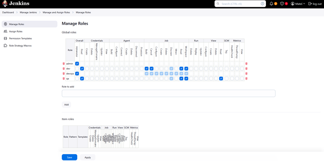
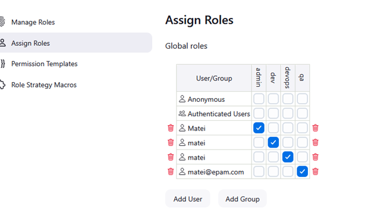
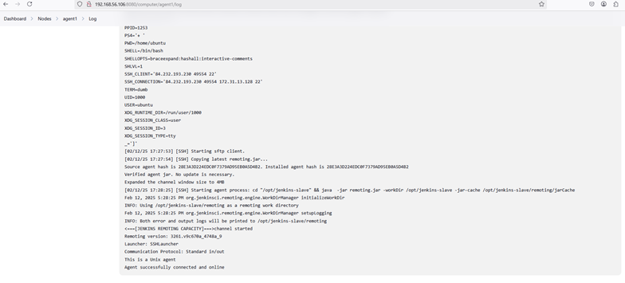
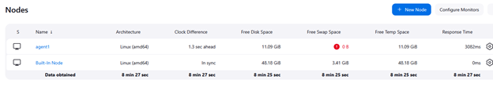
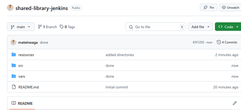
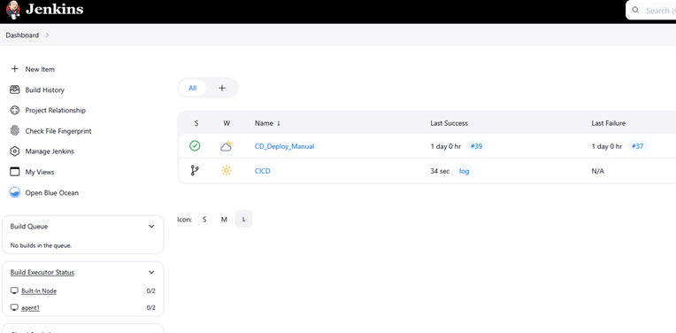
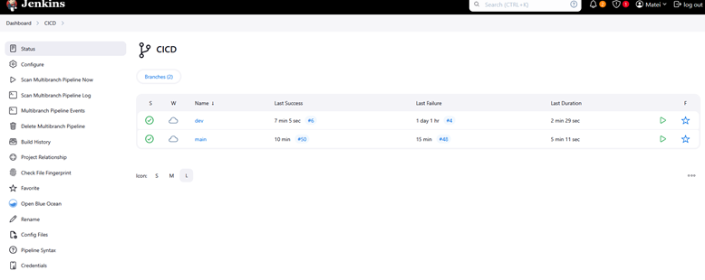
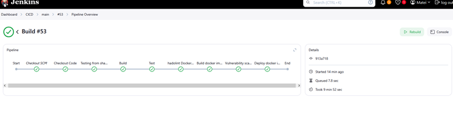
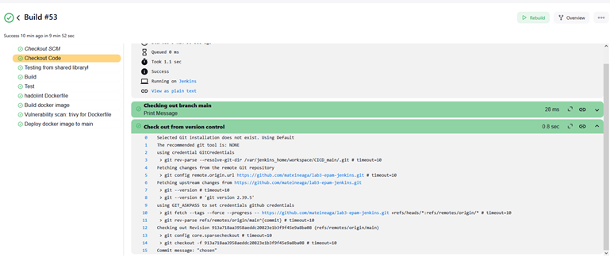
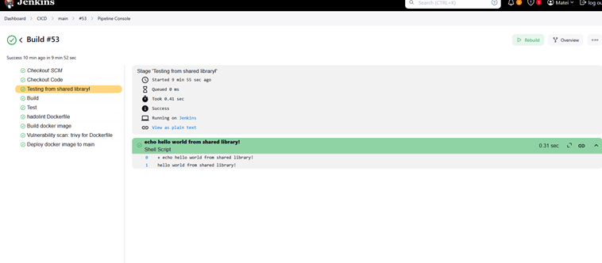
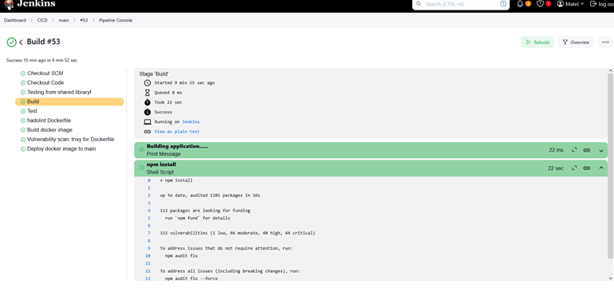
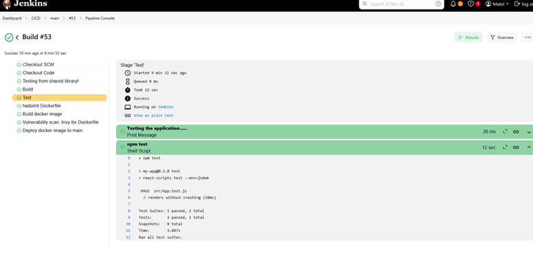
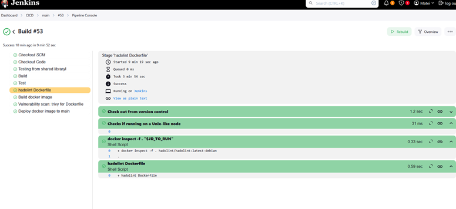
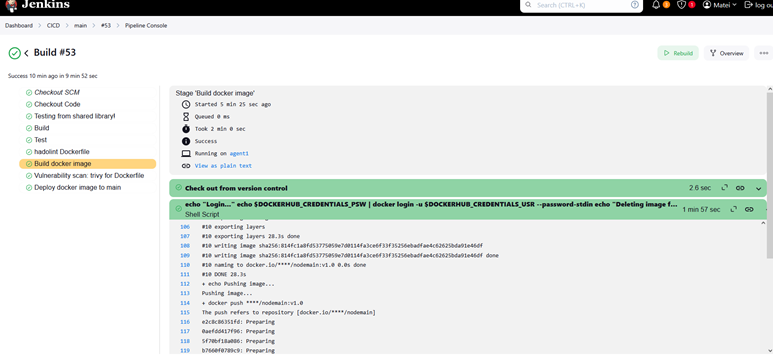
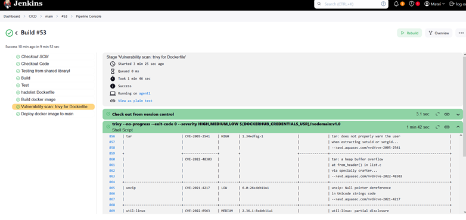
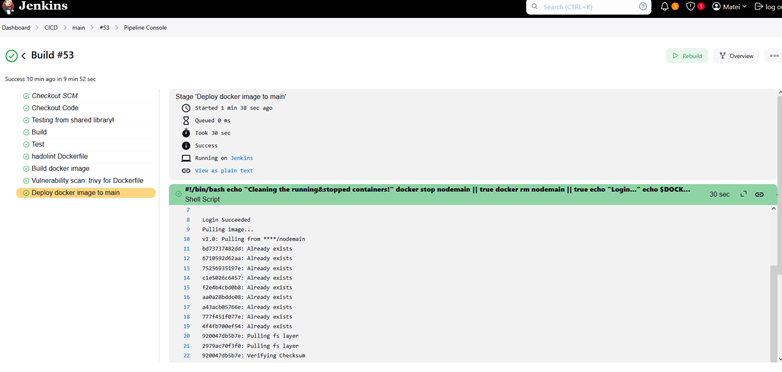
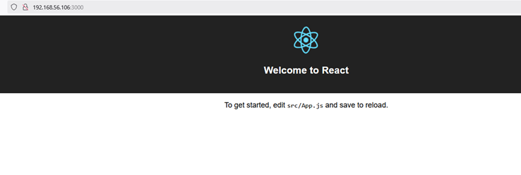
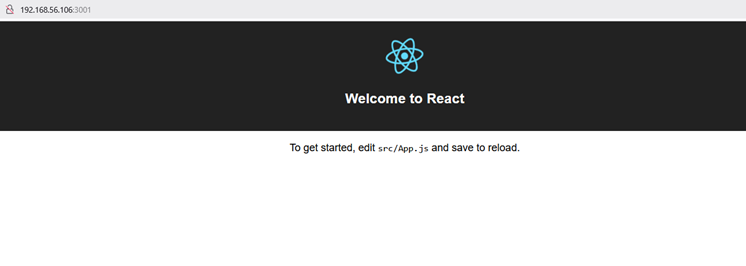
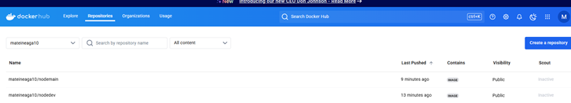
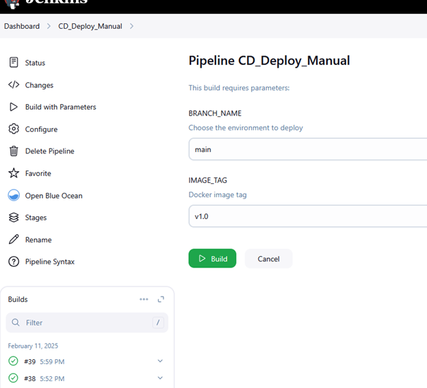
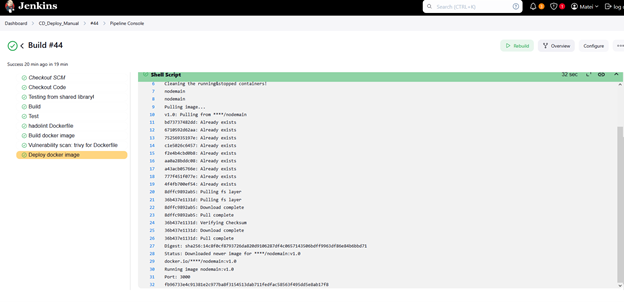

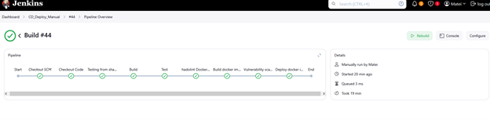

